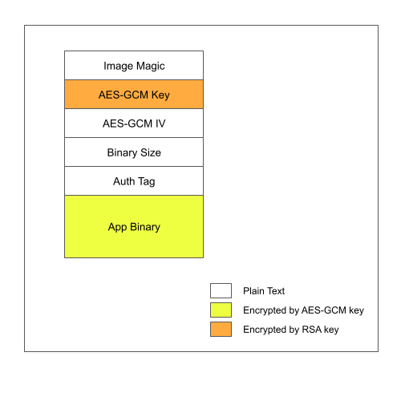

# _Encrypted Binary OTA_

(See the README.md file in the upper level 'examples' directory for more information about examples.)

This example is based on OTA update with an encrypted binary using APIs from `esp_encrypted_img`.

## Encrypted Image Format



Flash Encryption should be enabled to protect the RSA Private Key present on the device.

## How to use example

To create self-signed certificate and key, refer to README.md in upper level 'examples' directory. This certificate should be flashed with binary as it will be used for connection with server.

### Creating RSA key

You can generate a public and private RSA key pair like this:

`openssl genrsa -out private.pem 3072`

This generates a 3072-bit RSA key pair, encrypts them with a password you provide and writes them to a file.

Export RSA Public key to a file:

`openssl rsa -in private.pem -outform PEM -pubout -out public.pem`

This key is used while encrypting the binary image.

Export RSA Private key to a file:

`openssl rsa -in private.pem -out private_unencrypted.pem -outform PEM`

This key is flashed ontu the device and flash encryption should be enabled to secure this private key.

### Using tool to create encrypted image

To encrypt, run:

`python esp_encrypted_img_generator/create_image.py <input_file_name> <path_to_rsa_public_key> <output_file_name> encrypt`

To decrypt, run:

`python esp_encrypted_img_generator/create_image.py <input_file_name> <path_to_rsa_private_key> <output_file_name> decrypt`

### Hardware Required

"ESP-Dev-Board" is necessary to run the OTA examples. Make sure Ethernet is configured correctly if testing OTA with Ethernet. For further information about setting up Ethernet, please refer to the Ethernet [examples](../../../ethernet).

### Configure the project

Open the project configuration menu (`idf.py menuconfig`).

In the `Example Connection Configuration` menu:

* Choose the network interface in the `Connect using`  option based on your board. Currently  both Wi-Fi and Ethernet are supported
* If the Wi-Fi interface is used, provide the Wi-Fi SSID and password of the AP you wish to connect to
* If using the Ethernet interface, set the PHY model under `Ethernet PHY Device` option, e.g. `IP101`

In the `Example Configuration` menu:

* Set the URL of the firmware to download in the `Firmware Upgrade URL` option. The format should be `https://<host-ip-address>:<host-port>/<firmware-image-filename>`, e.g. `https://192.168.2.106:8070/hello_world.bin`
  * **Note:** The server part of this URL (e.g. `192.168.2.106`) must match the **CN** field used when [generating the certificate and key](#run-https-server)

### Build and Flash

Build the project and flash it to the board, then run monitor tool to view serial output:

```
idf.py -p PORT flash monitor
```

(Replace PORT with the name of the serial port to use.)

(To exit the serial monitor, type ``Ctrl-]``.)

See the Getting Started Guide for full steps to configure and use ESP-IDF to build projects.
